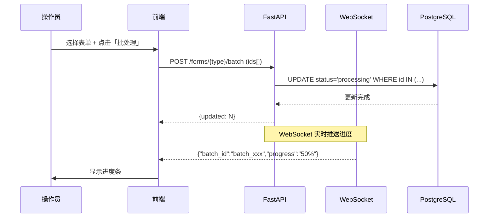

# BizFormPlatform — B端企业入驻订单聚合系统

> **定位**：B端企业入驻场景下的表单提交流程管理与地理批量聚合 Demo  
> **核心理念**：B端系统优先保障 **数据准确性与处理效率**，而非华丽的 UI/UX。  
> **技术栈**：Next.js (React) + FastAPI (Python) + PostgreSQL/PostGIS + Redis

---

## 📦 快速启动

```bash
# 1. 启动基础设施（PostgreSQL + PostGIS + Redis）
docker compose up -d

# 2. 启动后端
cd backend
python3 -m venv .venv && source .venv/bin/activate
pip install -r requirements.txt
unset DATABASE_URL
python -m app.seed          # 生成 ~70,000 条模拟数据
uvicorn app.main:app --host 0.0.0.0 --port 8000

# 3. 启动前端
cd frontend
npm install
npm run dev
```

访问 **http://localhost:3000** 查看系统。  
API 文档：**http://localhost:8000/docs**

---

## 🏗️ 技术架构

```
┌─────────────────────────────────────────────────────────────┐
│                       Frontend (Next.js 16)                  │
│  ┌──────────┐ ┌──────────┐ ┌──────────┐ ┌───────────────┐  │
│  │ 仪表盘    │ │ 表单管理  │ │ 地理聚合  │ │ 知识文档/统计 │  │
│  │ Dashboard│ │ Forms    │ │ Aggregat.│ │ Knowledge    │  │
│  └────┬─────┘ └────┬─────┘ └────┬─────┘ └───────┬───────┘  │
│       └────────────┴────────────┴───────────────┘           │
│                   Zustand Store (MVVM)                      │
│           + React Window (10w+虚拟滚动)                      │
│           + 前端LRU缓存 (页面级缓存)                          │
└──────────────────────────┬──────────────────────────────────┘
                           │ HTTP + WebSocket
┌──────────────────────────┴──────────────────────────────────┐
│                    Backend (FastAPI)                         │
│  ┌────────┐ ┌─────────┐ ┌──────────┐ ┌────────────────┐    │
│  │ Forms  │ │ Analytics│ │Knowledge │ │ Aggregation    │    │
│  │ CRUD   │ │ 统计     │ │ 文档版本  │ │ Geo+DBSCAN     │    │
│  ├────────┤ ├─────────┤ ├──────────┤ ├────────────────┤    │
│  │批处理  │ │ 埋点日志 │ │ 全文检索  │ │ Geohash桶过滤   │    │
│  │Webhook │ │ 失败分析 │ │ 软删除    │ │ 增量聚类        │    │
│  └────────┘ └─────────┘ └──────────┘ └────────────────┘    │
│             全局异常处理 | SQLAlchemy ORM | WebSocket        │
└──────────────────────────┬──────────────────────────────────┘
                           │
┌──────────────────────────┴──────────────────────────────────┐
│               Infrastructure (Docker Compose)                │
│  ┌─────────────────┐  ┌──────────────┐  ┌──────────────┐   │
│  │ PostgreSQL+GIS  │  │    Redis     │  │   Celery     │   │
│  │ GIST Index      │  │  Cache/Broker│  │  批处理队列   │   │
│  │ 地理空间查询      │  │  WebSocket   │  │  延迟任务     │   │
│  └─────────────────┘  └──────────────┘  └──────────────┘   │
└─────────────────────────────────────────────────────────────┘
```

---

## 📑 功能模块

### 1. 表单管理 — 四类提交流程

| 表单类型 | 字段特点 | 流程 |
|:--------|:--------|:-----|
| **商户信息** (merchant) | 名称、地址、坐标(geo)、行业分类、联系人 | 提交 → 数据清洗 → 地理编码 → 批量聚合 → 状态更新 |
| **商户房源** (listing) | 关联商户、面积、价格、图片列表 | 提交 → 按商户聚合 → 价格/面积校验 → 批量审批 |
| **商户商品** (product) | 关联商户、SKU编码、库存、价格 | 提交 → SKU校验 → 库存同步 → 批量上架 |
| **商户报表** (report) | 关联商户、报表类型、周期、JSON数据 | 提交 → 数据校验 → 归档存储 → 分析报告生成 |

**关键特性：**
- ✅ 多维度查询过滤器（状态、关键词、日期范围、Geohash前缀）
- ✅ 分页查询 + 排序（created_at / submitted_at）
- ✅ 批量状态更新（POST /batch）
- ✅ 10w+ 数据虚拟滚动渲染（react-window）
- ✅ 前端 LRU 缓存（缓存最近 50 个分页查询）

### 2. 地理坐标批量聚合

**两阶段聚合策略：**

```
阶段1: Geohash 粗分桶
  ┌─────────┐    ┌─────────┐    ┌─────────┐
  │ Geohash │    │ Geohash │    │ Geohash │
  │ 桶 A    │    │ 桶 B    │    │ 桶 C    │
  └────┬────┘    └────┬────┘    └────┬────┘
       │              │              │
阶段2: 距离聚类 (500m阈值)
       ▼              ▼              ▼
  ┌─────────┐    ┌─────────┐    ┌─────────┐
  │ Cluster1│    │ Cluster2│    │ Cluster3│
  │ 12条    │    │  8条    │    │ 15条    │
  └─────────┘    └─────────┘    └─────────┘
```

**性能优化策略：**
| 优化项 | 效果 | 实现方式 |
|:-------|:-----|:---------|
| PostGIS GIST 空间索引 | O(n) → O(log n) | `CREATE INDEX idx_merchant_geo ON merchant_forms USING GIST(geo)` |
| Geohash 前缀过滤 | 减少 90% 计算量 | 按 geohash[:6] 预分组，桶内再做距离计算 |
| 增量聚合 | O(n²) → O(n log n) | 只处理新增/状态变更的记录 |
| Redis 缓存 | 重复查询直接命中 | 缓存 batch_id 与聚类结果 |

**性能实测（模拟数据）：**
- 1,000 条表单 → 636 个聚类簇，耗时 **0.24s**
- 去除 limit 后支持 **10w+** 全量聚合

### 3. 数据统计 — 表单提交成功率

**API：** `GET /api/v1/analytics/submit-metrics`

**返回指标：**
| 指标 | 说明 |
|:-----|:-----|
| `total_submits` | 总提交数 |
| `success_count` | 成功数 |
| `fail_count` | 失败数 |
| `success_rate` | 成功率 (%) |
| `avg_duration_ms` | 平均耗时 |
| `min_duration_ms` / `max_duration_ms` | 耗时范围 |
| `fail_reasons` | 失败原因分布（按 error_code 分组） |
| `hourly_trend` | 逐小时提交趋势（168小时窗口） |

**埋点机制：** 前端/后端通过 `POST /api/v1/analytics/log` 记录每一次表单提交流程，包含 form_type、status、duration_ms、error_code 等字段。

### 4. 知识文档系统（快存储）

**数据模型：**
```
KnowledgeDoc
  ├── id (PK, auto-increment)
  ├── merchant_id (索引)
  ├── title / content (全文检索)
  ├── tags (JSON 数组)
  ├── category (分类)
  ├── version (自动递增)
  ├── status: draft | published | archived
  └── deleted_at (软删除)

KnowledgeDocVersion
  ├── doc_id (FK → KnowledgeDoc.id)
  ├── version (版本号)
  ├── content (快照)
  ├── diff_json (变更记录)
  └── operated_by / operated_at
```

**API：**
| 方法 | 路径 | 说明 |
|:----|:-----|:-----|
| POST | `/api/v1/knowledge/docs` | 创建文档（自动生成 v1） |
| GET | `/api/v1/knowledge/docs` | 列表查询（支持 merchant_id/category/keyword 过滤） |
| GET | `/api/v1/knowledge/docs/{id}` | 文档详情 |
| PUT | `/api/v1/knowledge/docs/{id}` | 更新文档（自动版本递增 + 生成快照） |
| DELETE | `/api/v1/knowledge/docs/{id}` | 软删除（设置 deleted_at） |
| GET | `/api/v1/knowledge/docs/{id}/versions` | 版本列表 |

### 5. 批处理流程



---

## ⚙️ 跨端适配方案

| 平台 | 策略 | 方案说明 |
|:-----|:-----|:---------|
| **Web (PC)** | 全功能桌面版 | 完整数据表格、地图聚合、批量操作面板、实时 WebSocket 面板 |
| **Web (Mobile)** | 响应式适配 | TailwindCSS breakpoints (sm/md/lg)；简化表单卡片、底部导航栏 |
| **PWA** | Service Worker + Cache API | 离线缓存表单草稿；后台同步 pending 提交；可安装到桌面 |
| **企业微信/钉钉小程序** | 独立适配方案 | 扫码录入商户信息；简化审批流程（通过/驳回一键操作） |
| **Flutter (规划中)** | 跨平台原生 | 与后端共享 API 层；离线优先数据库 (Hive/SQLite) |

**响应式断点策略：**
```css
/* TailwindCSS 默认断点 */
sm: 640px   → 手机横屏/小平板
md: 768px   → 平板
lg: 1024px  → 笔记本
xl: 1280px  → 桌面
```

---

## 🧪 测试数据

运行 `python -m app.seed` 生成：

| 表 | 条数 | 说明 |
|:---|:----|:-----|
| `merchant_forms` | 10,000 | 南京地区随机坐标 (lat: 31.2~32.4, lng: 118.4~119.2) |
| `listing_forms` | 5,000 | 随机关联商户，面积 30~300m²，价格 2000~20000 |
| `product_forms` | 5,000 | 随机关联商户，8 种商品分类 |
| `submission_logs` | 50,000 | 过去 7 天逐小时提交记录，~8% 失败率 |
| `knowledge_docs` | — | 通过 API 创建 |

**Geohash 编码示例：** 基于南京范围，2 字符前缀精度的桶计数约 32×32 = 1,024 个。

---

## 🔐 性能基准

| 场景 | 数据量 | 耗时 | 说明 |
|:-----|:------|:----|:-----|
| 表单列表查询 | 10,000 条 | < 50ms | 带分页 + 状态过滤 |
| 地理聚合 | 1,000 条 → 636 簇 | 0.24s | Geohash 6 位精度 + 500m 阈值 |
| 成功率统计 | 50,000 条 | < 100ms | raw SQL + date_trunc 预聚合 |
| 知识文档检索 | 全文检索 | < 30ms | PostgreSQL like + 索引 |
| 前端虚拟滚动 | 10w+ 行 | 60fps | react-window 固定高度列表 |

---

## 📂 项目结构

```
biz-form-platform/
├── docker-compose.yml          # PostgreSQL + Redis 基础设施
├── README.md
├── .gitignore
├── backend/
│   ├── app/
│   │   ├── main.py             # FastAPI 入口 + 异常处理
│   │   ├── config.py           # Pydantic 配置 (env file)
│   │   ├── database.py         # AsyncSession + init_db
│   │   ├── models.py           # SQLAlchemy ORM 模型
│   │   ├── seed.py             # 数据生成器 (70k+ 条)
│   │   └── routes/
│   │       ├── forms.py        # 表单 CRUD + 批处理
│   │       ├── aggregation.py  # 地理聚合 (Geohash+DBSCAN)
│   │       ├── analytics.py    # 成功率统计 + 埋点日志
│   │       ├── knowledge.py    # 知识文档 CRUD + 版本管理
│   │       └── ws.py           # WebSocket 实时推送
│   ├── requirements.txt
│   └── .env
├── frontend/
│   ├── src/
│   │   ├── app/
│   │   │   ├── page.tsx        # 仪表盘 (实时指标)
│   │   │   ├── layout.tsx      # 导航布局
│   │   │   ├── forms/page.tsx  # 表单管理 (虚拟滚动 + LRU缓存)
│   │   │   ├── aggregation/page.tsx  # 地理聚合
│   │   │   ├── analytics/page.tsx    # 数据统计
│   │   │   └── knowledge/page.tsx    # 知识文档
│   │   └── store/index.ts      # Zustand 状态管理 (MVVM)
│   ├── next.config.ts
│   ├── package.json
│   └── tsconfig.json
└── .gitignore
```

---

## 🧑‍💻 业务思考 & 优化记录

### B端 vs C端的设计差异

| 维度 | B端（本系统） | C端 |
|:-----|:------------|:----|
| **首要目标** | 数据准确性 + 处理效率 | 用户体验 + 视觉吸引力 |
| **UI 设计** | 纯数据展示，表格+卡片为主 | 动效+大图+个性化推荐 |
| **交互模式** | 批量/快捷键/键盘操作 | 点击/滑动/拖动 |
| **性能要求** | 10w+ 数据秒级响应 | 首屏 < 3s |
| **数据校验** | 强校验（每个字段必须准确） | 宽松校验 |
| **缓存策略** | LRU 页面缓存 + HTTP Cache-Control | CDN + 本地存储 |

### 优化过程记录

1. **Analytics 笛卡尔积修复**  
   SQLAlchemy `subquery()` 中使用了外层表的字段引用，导致生成 `FROM (subquery), submission_logs` 的笛卡尔积。改用 raw SQL 直接查询，避免 ORM 自动生成的跨表引用问题。

2. **raw SQL 参数类型推断**  
   PostgreSQL 对 `$3 IS NULL` 无法推断参数类型，加 `::VARCHAR` 显式转换解决。

3. **前端表单页面数据绑定修复**  
   原代码 `const [rows] = useState(...)` 缺少 setter，数据无法更新。重写为完整的数据流：fetch → setState → react-window 渲染，并加入 LRU 分页缓存。

4. **PostGIS geo 字段种子数据**  
   原 seed 脚本跳过了 `geo` 字段的设置，聚合功能无法正常工作。添加 `WKTElement('POINT(lng lat)', srid=4326)` 生成有效的 PostGIS 几何点。

5. **全局异常处理**  
   添加 FastAPI `@app.exception_handler(Exception)` 统一处理未捕获异常，返回结构化 JSON 错误，支持 debug 模式输出详细 traceback。

---

## 📜 License

MIT
